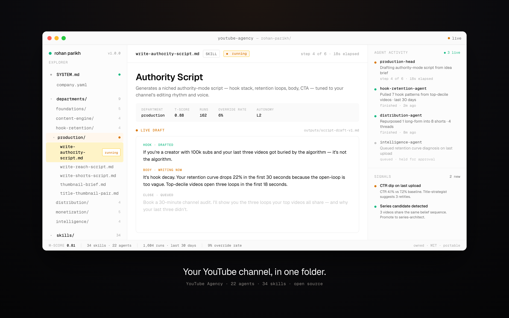

<div align="center">

<picture>
  <source media="(prefers-color-scheme: dark)" srcset="docs/assets/heuresis-logo-dark.png">
  <source media="(prefers-color-scheme: light)" srcset="docs/assets/heuresis-logo-light.png">
  
</picture>

<br/>
<br/>

<h1>YouTube Agency</h1>

<p><strong>Your YouTube channel, encoded.</strong></p>

<p>
  <a href="CHANGELOG.md"></a>
  <a href="LICENSE"></a>
  <a href="https://heuresis.ai"></a>
</p>

</div>

<br/>



<p align="center"><em>Your YouTube channel, in one folder.</em></p>

<br/>

---

## What is this?

Think of it like this: a great YouTube channel has departments — research, hook engineering, retention, scripting, thumbnails, distribution, and the back-end offer that turns viewers into customers. Each one has standards, instincts, and reps the creator carries in their head.

**YouTube Agency is that whole org chart, written down as a folder of plain markdown files.**

Open the folder. Hand it to any AI agent — Claude, ChatGPT, Cursor, OpenClaw. The agent reads `SYSTEM.md`, learns your channel, and starts running a department.

You stay in the loop on the calls that need taste. Hook decay gets caught the day it starts, not after three videos buried by the algorithm.

| Step | What happens |
|---|---|
| **01** | Clone the folder |
| **02** | Fill in `company.yaml` with your channel — niche, audience, voice, back-end offer |
| **03** | Hand the folder to any agent. It reads `SYSTEM.md`, becomes a YouTube channel operator, and starts shipping |

<br/>

---

## Without this · With this

| Without | With |
|---|---|
| The editor drifts off-style by month 3. The cuts feel like someone else's channel. | Editing rhythm is encoded. Every editor brief ships with the channel's exact pacing. |
| Hook quality decays the moment you stop writing every script. | Hook patterns from your top-decile videos are encoded. Every script clears the hook density floor. |
| The channel becomes whatever the last freelancer made — not what you would have made. | Your taste lives in `agents/` and `reference/`. Every output is judged against it before it ships. |
| You upload, the algorithm decides, and you guess what to do next. | A six-layer leak audit runs every Monday. CTR, AVD, and back-end conversion get diagnosed, not guessed. |
| One long-form ships. The eight pieces of distribution gets done sometimes. | Every published video triggers a repurposing cascade — 8 shorts, 4 threads, an email — automatically. |

<br/>

---

## Try it

```bash
git clone https://github.com/Heuresis/YouTube-Agency.git your-channel
cd your-channel
./boot.sh
```

Boot prints the workspace credentials and runtime install options. Then
install into your runtime of choice:

```bash
./scripts/install.sh --tool claude-code
```

Eleven runtimes supported. See [Multi-tool integrations](#multi-tool-integrations).

Fill in `company.yaml` with your channel context. Then ask for what you need:

```
/build-niche                 a niche definition
/build-audience              an ideal viewer profile
/design-offer                a back-end offer document
/build-channel-architecture  a channel architecture document
/idea-farm                   a 20+ idea backlog
/write-script                a complete script, end-to-end — the per-video entry point
/write-authority-script      a niched script
/write-reach-script          a broad-appeal script
/write-pinned-vsl            a pinned video sales letter
/title-thumbnail-pair        title + thumbnail concepts with predicted CTR
/leak-audit                  a six-layer funnel diagnostic
```

Full setup walkthrough: **[Quickstart](docs/QUICKSTART.md)** · 30 minutes.

<br/>

---

## How it fits together

Every Heuresis workspace is the same shape. A boot layer reads your channel context, then activates the org-chart, skill outputs, methodology brain, and trigger manifest. Eleven runtime integrations ship — see [Multi-tool integrations](#multi-tool-integrations).

```text
┌──────────────────────────────────────────────────────────────┐
│                    THE ENCODED WORKSPACE                     │
│                                                              │
│  ┌───────────┐  ┌───────────┐  ┌───────────┐  ┌───────────┐  │
│  │ SYSTEM.md │  │ ENCODING  │  │ INVARIANTS│  │  company  │  │
│  │ boot file │  │  schema   │  │   rules   │  │  context  │  │
│  └───────────┘  └───────────┘  └───────────┘  └───────────┘  │
│                                                              │
│  ┌───────────┐  ┌───────────┐  ┌───────────┐  ┌───────────┐  │
│  │  agents/  │  │  skills/  │  │ reference/│  │  triggers │  │
│  │ org chart │  │  outputs  │  │   brain   │  │  manifest │  │
│  └───────────┘  └───────────┘  └───────────┘  └───────────┘  │
└──────────────────────────────────────────────────────────────┘
                            │
                            ▼
        any agent runtime that reads files — 11 ship
```

<br/>

---

## What's inside the folder

```text
youtube-agency/
│
├── README.md            ←  the pitch
├── SYSTEM.md            ←  boot file · any AI becomes a YouTube channel operator
├── INVARIANTS.md        ←  17 sacred rules
├── ENCODING.md          ←  11-compartment schema
├── company.yaml         ←  YOUR channel · fill once
│
├── agents/              ←  22 specialists · an org chart of a real studio
│      youtube-ceo                  top orchestrator
│      2 arc orchestrators  ·  8 department heads  ·  11 specialists
│
├── workspace/           ←  the operating layer · YOUR channel's living documents
│      STRATEGY · VOICE · PROOF-BANK · CONTENT-ENGINE   the 4-doc profile
│      CALIBRATION.md               binds every skill to this channel
│      pipeline/ → film-this-week/ → drafts/ → published/   the video lifecycle
│      published/_ANALYTICS.md      the feedback loop that re-ranks the slate
│      prompts/                     9 creator-calibrated generators + signal-check gate
│
├── agents/              ←  22 specialists · an org chart of a real studio
│      youtube-ceo                  top orchestrator
│      2 arc orchestrators  ·  8 department heads  ·  11 specialists
│
├── skills/              ←  35 capabilities · each produces one asset
│   │
│   │   FOUNDATIONS
│   ├── /build-niche                  Niche definition
│   ├── /build-audience               Audience intelligence
│   ├── /design-offer                 Back-end offer
│   ├── /build-channel-architecture   Channel architecture document
│   └── /extract-creator-voice        Brand voice + on-camera persona
│   │
│   │   CONTENT ENGINE
│   ├── /idea-farm                    Rolling backlog of ideas
│   ├── /research-brief               Per-video research pack
│   ├── /content-mix-strategy         Authority/reach ratio
│   └── /series-architect             Multi-video belief sequence
│   │
│   │   HOOK & RETENTION
│   ├── /write-hook                   First-30s hook stack
│   ├── /architect-loops              Open-loop placement
│   ├── /retention-engineer           AVD prediction pass
│   └── /audit-retention              Post-publish curve diagnosis
│   │
│   │   PRODUCTION
│   ├── /write-script              ★  Any script, end-to-end · the per-video entry point
│   ├── /write-authority-script       Niched script
│   ├── /write-reach-script           Broad-appeal script
│   ├── /write-shorts-script          Shorts script
│   ├── /thumbnail-brief              Thumbnail spec
│   ├── /title-thumbnail-pair         Title + thumbnail pair
│   └── /editor-brief                 Editor brief
│   │
│   │   DISTRIBUTION
│   ├── /title-options  ·  /description-builder  ·  /publish-checklist  ·  /repurposing-cascade
│   │
│   │   AUDIENCE & MONETIZATION
│   ├── /community-cadence  ·  /lead-magnet-bridge  ·  /cross-niche-bridge
│   ├── /write-pinned-vsl  ·  /build-application-funnel
│   └── /sales-call-script  ·  /sponsor-fit
│   │
│   │   OPERATIONS  ·  INTELLIGENCE
│   └── /build-sop  ·  /kpi-dashboard  ·  /leak-audit  ·  /library-compound
│
├── prompts/             ←  the fast lane · 10 one-shot prompt packs
│      content · repurposing · research · brand-voice · sales
│      offer · email · VSL · ad-creative · analytics
│
└── reference/           ←  the brain that makes skills smart
    ├── frameworks/             53 methodology docs — hooks · loops · awareness ·
    │                           sophistication · belief layers · influence · community ·
    │                           zero-sum positioning · planning-vs-spoken doctrine
    ├── operators/              12 archetyped playbooks
    ├── platforms/              long-form · Shorts · Live · Community Tab
    ├── playbooks/              8 multi-step playbooks
    ├── swipe-file/             262 anonymized specimens (hooks · intros · scripts · titles · thumbnails · contrast formats · series)
    ├── templates/              12 output templates + example-scripts calibration corpus
    ├── benchmarks/             real performance bands by niche
    ├── verticals/              8 vertical packs
    └── canonical/              architecture bible + canonical specs
```

Each file is plain text. Each folder is owned by you. Nothing is locked behind an app.

<br/>

---

## Each video ships with

- **Script** — authority or reach mode, hook density verified, retention floor cleared, voice gates passed (banned-vocab clear · no spoken BUT/THEREFORE · read-aloud clean · Blind Output Test ≥ 7)
- **Title + thumbnail pair** — promise-aligned to the first 30 seconds
- **Editor brief** — cuts, b-roll, music, supers per the channel's editing rhythm
- **Description** — timestamps + link stack matching the channel architecture
- **Publish checklist** — end-screens, cards, community-tab pre-post, premiere config
- **Repurposing cascade** — 1 long-form into 8–12 distribution units (Shorts, posts, threads, email)
- **Post-publish audit** — retention curve diagnosed at T+7 days; pattern fed back into the library

Every action leaves a receipt. Every video updates the encoded brain. Every cycle, the channel gets sharper.

<br/>

---

## Runs while you sleep

Wire the workspace into a runtime with **cron, webhook, and event triggers**. The agents keep working without you in the room.

- **Daily 06:00 (cron)** — idea-farmer queues new candidates from comments, suggested, and trends
- **Monday 09:00 (cron)** — leak-auditor runs the six-layer funnel review, sends report
- **On `video.published` (event)** — repurposing-cascade fires; T+7d audit-retention queued
- **On `application.received` (webhook)** — qualification + routing through the application funnel
- **On `call.completed` (event)** — post-call sequence kicks off
- **Continuous (event)** — title-strategist watches CTR, suggests retitles after 48h if underperforming

Triggers are declared in [`paperclip.manifest.yaml`](paperclip.manifest.yaml). Wire them to your scheduler and the workspace operates as a 24/7 channel team.

<br/>

---

## What you get

**9 agent-first departments. 22 agents. 35 skills. 10 fast-lane prompt packs. A living operating layer.**

- **Foundations** — niche · audience · offer · channel architecture · creator voice
- **Content Engine** — idea farm · research · dual-mode mix · series architecture
- **Hook & Retention** — hook formulas · loop architecture · retention engineering · post-publish audit
- **Production** — authority + reach + Shorts scripts · thumbnails · editor briefs
- **Distribution** — titles · descriptions · publish checklists · repurposing cascades
- **Audience Building** — community · email pipeline · cross-niche bridge
- **Monetization & Sales** — pinned VSL · application funnel · sales scripts · sponsor fit
- **Operations** — SOPs per team configuration
- **Intelligence** — KPI dashboard · leak audits · library compound
- **Operating layer** — `workspace/` holds the channel's living documents: strategy, voice, proof bank, content engine, a proof-gated video pipeline, and the published-video analytics loop that re-ranks what you film next

Each department is a full department rebuilt as agent-first — agents that carry your taste, read signals, and make decisions.

<br/>

---

## Multi-tool integrations

The workspace is files. Files run anywhere that reads files. The Agency
ships conversion + install scripts so the same agents work across every
major agentic coding tool — no vendor lock, no rewrite.

| Tool | Install | Destination |
|---|---|---|
| **Claude Code** | `./scripts/install.sh --tool claude-code` | `~/.claude/agents/heuresis-youtube-agency/` |
| **GitHub Copilot** | `./scripts/install.sh --tool copilot` | `~/.github/agents/` + `~/.copilot/agents/` |
| **Antigravity (Gemini)** | `./scripts/install.sh --tool antigravity` | `~/.gemini/antigravity/skills/` |
| **Gemini CLI** | `./scripts/install.sh --tool gemini-cli` | `~/.gemini/extensions/heuresis-youtube-agency/` |
| **OpenCode** | `./scripts/install.sh --tool opencode` | `./.opencode/agents/` |
| **Cursor** | `./scripts/install.sh --tool cursor` | `./.cursor/rules/` |
| **Aider** | `./scripts/install.sh --tool aider` | `./CONVENTIONS.md` |
| **Windsurf** | `./scripts/install.sh --tool windsurf` | `./.windsurfrules` |
| **OpenClaw** | `./scripts/install.sh --tool openclaw` | `~/.openclaw/heuresis-youtube-agency/` |
| **Qwen Code** | `./scripts/install.sh --tool qwen` | `./.qwen/agents/` |
| **Kimi Code** | `./scripts/install.sh --tool kimi` | `~/.config/kimi/agents/` |

Five tools (Antigravity, Gemini CLI, OpenClaw, Cursor, Kimi) require format
conversion — the install script handles it transparently. To inspect the
converted artifacts before deploying:

```bash
./scripts/convert.sh --tool <tool-name>
ls build/<tool-name>/
```

Every tool has its own README with activation patterns, customization notes,
and uninstall steps. Full list: **[integrations/README.md](integrations/README.md)**.

Runtime-swappable. Your workspace is the asset. The runtime is replaceable.

<br/>

---

## Capabilities

What every Heuresis workspace ships with, regardless of which runtime you point at it.

| Property | What it does |
|---|---|
| **Plain-text workspace** | Every agent, skill, and framework is markdown + YAML. Read it, fork it, version it, diff it. |
| **Runtime-portable** | The same files run across every major agentic tool. Eleven integrations ship — see [Multi-tool integrations](#multi-tool-integrations). |
| **Goal ancestry** | Every skill carries the channel's niche, audience, offer, and creator voice as live context. Agents act on the *why*, not just the *what*. |
| **Encoded judgement** | Agents carry the creator's taste, retention instincts, and quality standards. The workspace replicates the creator's judgement, not their task list. |
| **Receipt trail** | Every cycle leaves an artefact — a script, a thumbnail brief, a CTR prediction, a retention diagnosis. Auditable end-to-end. |
| **Compounding library** | Every published video updates the swipe-file, hook bank, and per-niche benchmarks. The encoded brain gets sharper each cycle. |
| **Proof-gated pipeline** | Every on-screen number traces to a verified proof-bank row. A video cannot move to filming until its proof exists. Claims ship with receipts. |
| **Trigger-ready** | Cron, webhook, and event triggers declared in a manifest. Wire to any scheduler — daily idea farming, T+7 retention audits, repurposing cascades — and the workspace operates while you sleep. |
| **Owned outright** | MIT-licensed. Fork it, host it, run it forever. Yours. |

<br/>

---

## Why this matters

Every founder-led creator business eventually hits the same wall: the founder IS every department.

The editor drifts off-style by month 3. Hook quality decays the moment you stop writing every script. The channel becomes whatever the last freelancer made — not what you would have made. You upload, the algorithm decides, and you guess what to do next.

Encoding changes the shape of the week. Your taste — hook style, retention instincts, sponsor judgement, the patterns you carry in your head — gets written into agents that run each department on your behalf. The creator stays. The taste scales. The channel compounds.

Every cycle, each department gets sharper. The gap between your channel and every creator operating off memory widens.

This is one template in the library. More shipping, vertical by vertical. Every outcome claim we publish traces to a real deployment with a real operator. Thesis, method, and source go public on ideas. Receipts wait their turn.

<br/>

---

## Roadmap

- ✅ 22 agents · 9 pillars · 35 skills shipped
- ✅ 53 framework docs · 12 operator archetypes · 8 vertical packs
- ✅ 262 swipe-file specimens — hooks · intros · scripts · titles · thumbnails · contrast formats
- ✅ Eleven runtime integrations: Claude Code · Copilot · Gemini · Cursor · Aider · Windsurf · OpenClaw · Qwen · Kimi · OpenCode · Antigravity
- ✅ Retention floor enforcement · dual-mode strategy
- ✅ Trigger manifest: cron · webhook · event
- ✅ Library compound after every publish
- ✅ `workspace/` operating layer — strategy · voice · proof bank · content engine · proof-gated pipeline · published analytics loop
- ✅ `/write-script` orchestrator — gather → strategy → structure → execute → reconcile → QA, with voice gates
- ✅ 10 fast-lane prompt packs — content · repurposing · research · brand-voice · sales · offer · email · VSL · ad-creative · analytics
- ✅ Persuasion + community frameworks — awareness × sophistication matrix · belief layers · influence principles · parasocial ethical guardrails
- ✅ Creator intake form + 30-minute expert-download interview
- ✅ Package renderer — script packaging to client-ready HTML
- ⚪ Auto-thumbnail generation pipeline
- ⚪ Comment-mining → idea-farm pipeline
- ⚪ Sponsor-fit scoring across the catalog
- ⚪ Multi-channel portfolio coordination
- ⚪ Per-niche retention benchmarks expansion
- ⚪ Heuresis Cloud — managed hosting for the workspace

<br/>

---

## Documentation

- [Quickstart](docs/QUICKSTART.md) — setup in 30 minutes
- [Architecture](docs/ARCHITECTURE.md) — how the folder is built
- [Channel Architecture](docs/CHANNEL_ARCHITECTURE.md) — designing the path-of-the-viewer
- [Dual-Mode Content Strategy](docs/DUAL_MODE.md) — when to use authority vs reach
- [Skill Authoring](docs/SKILL_AUTHORING.md) — write your own agents and skills

## License

MIT. Free forever.

Built by [Syed Hussain](https://heuresis.ai) at [Heuresis](https://heuresis.ai).
