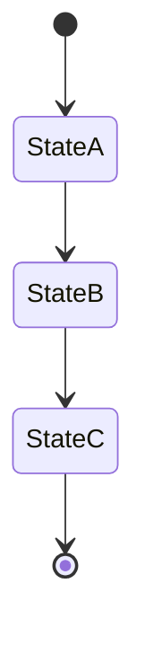
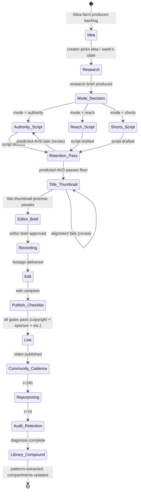

# Workflow Divisions — FSM-per-pillar

> Each pillar's primary workflow is encoded as a finite state machine (mermaid). FSMs declare states, transitions, owners, and the verification gates each transition passes through.

---

## The 9 pillar FSMs

| Pillar | Primary FSM | File |
|---|---|---|
| Foundations | strategic-layer-encoding | `foundations.md` |
| Content Engine | ideation-to-publishing-pipeline | `content-engine.md` |
| Hook & Retention | hook-loop-retention-pass | `hook-retention.md` |
| Production | production-pipeline | `production.md` |
| Distribution | publish-and-distribute | `distribution.md` |
| Audience Building | audience-loop | `audience-building.md` |
| Monetization & Sales | application-funnel-flow | `monetization-sales.md` |
| Operations | sop-management | `operations.md` |
| Intelligence | leak-audit-and-compound | `intelligence.md` |

Plus the cross-pillar master flow:

`master-channel-flow.md` — the end-to-end flow from a single video idea through ideation → research → script → retention engineering → production → publish → distribution → community → conversion → library-compound.

---

## How an FSM is structured

Every FSM file:

```markdown
# <Pillar> FSM

## Mermaid diagram


## States

### StateA
- **Owner**: <agent>
- **Skills available**: <list>
- **Entry condition**: <what triggers entry>
- **Exit condition**: <what triggers exit>
- **Verification gates at exit**: <list>

### StateB
... (one section per state)

## Transitions

| From | To | Trigger | Skill invoked | Gates |
|---|---|---|---|---|
| StateA | StateB | <event> | /<skill> | <gates> |
| StateB | StateC | <event> | /<skill> | <gates> |

## Failure paths

When a transition fails verification:
- Path 1: <revision loop>
- Path 2: <escalation>
```

---

## Master channel flow (end-to-end)



The master flow is the spine of every video that ships. Every state has an owner, a skill, and a set of gates.

---

## Key gates per transition

| Transition | Gate enforced |
|---|---|
| Mode_Decision → Authority_Script | required compartments at threshold |
| Retention_Pass → Title_Thumbnail | retention floor (INV-9) |
| Title_Thumbnail → Editor_Brief | title-thumbnail-promise (INV-10) |
| Edit → Publish_Checklist | hook density (INV-11), banned vocab |
| Publish_Checklist → Live | copyright/fair-use (INV-14), sponsor disclosure (INV-15), engagement-bait scan |

---

## Failure paths

Every gate failure follows the same pattern:

1. Failure logged with reason
2. Skill enters revision mode (max 2 attempts)
3. If revision-2 fails: escalate to creator with explicit "I tried X and Y, neither cleared. Need your judgement."
4. Creator either: (a) overrides with reason logged, (b) takes manual action, (c) revises themselves

The OS never silently passes a failed gate. Every gate either passes or is explicitly overridden.

---

*Version: 1.0.0 — 2026-05-03.*
*A Heuresis workspace template.*
